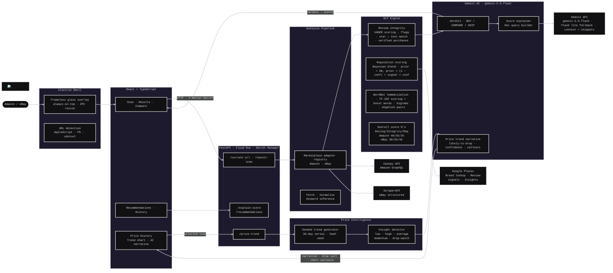

<table width="100%">
  <tr>
    <td width="50%" align="center" style="vertical-align: top;">
      <video src="https://github.com/user-attachments/assets/ddae5e9f-4c1e-467c-8047-de4eda39c38a" width="100%" controls></video> 
    </td>
    <td width="50%" align="center" style="vertical-align: top;">
      
    </td>
  </tr>
</table>

E-commerce lacks trustworthy product intelligence, with consumers losing $245 billion to poor purchasing decisions yearly in the US alone. That's why we built Nectar, a desktop overlay application that helps consumers make smarter online purchasing decisions by analyzing products on Amazon and eBay in real time. The app combines review authenticity detection, AI review summaries/product verdicts, personalized recommendations, brand reputation analysis, estimated price trends, and product comparison tools to identify trustworthy products and flag potentially misleading listings. By increasing transparency in e-commerce, Nectar reduces decision fatigue and empowers users to shop with greater confidence and accuracy.

## Features
- AI-powered product analysis
- Review integrity detection
- Brand and seller reputation scoring
- Personalized product recommendations
- Product comparison tools
- Scan history and recommendation memory
- Estimated price trends and AI price-timing metrics
- Amazon and eBay support

## Technologies Used
- Frontend: React, TypeScript, Vite, CSS
- Desktop Shell: Electron
- Backend: FastAPI, Python
- AI: Google Gemini
- NLP/Scoring: NLTK --> VADER, custom review-integrity logic
- Marketplace Data: Canopy API, ScraperAPI
- Reputation Data: Google Places API
- Storage: Browser localStorage for scan history/recommendations and price intelligence
- Deployment: Docker, Google Cloud Run, Cloud Build

---

## Architecture Diagram

> **Note on Price History:** The price trend chart and "likely to drop" call are generated, not scraped from real marketplace history. Nectar deterministically synthesizes a 30-day series anchored to the actual scraped price (so the chart always ends at the true current price), with a seeded wiggle, drift, and one simulated dip for realism. Gemini then writes a narrative and confidence score based on that synthetic series. This is a placeholder for a future real price-tracking integration and should not be used to make real purchasing-timing decisions.

# How to Use
## Clone Repository
Requirements:
- Python 3.11+
- Node.js 20+
```powershell
git clone https://github.com/shivankvirdi/Nectar-GDG.git
cd Nectar-GDG
```
## Backend Setup
> Skip this section if you're only using the hosted backend
```powershell
cd backend
python -m venv .venv
```
### Activate virtual environment
```powershell
.venv\Scripts\activate # Windows
source .venv/bin/activate # Mac/Linux
```
### Install dependencies
```powershell
pip install -r requirements.txt
```
## Frontend Setup
Install Node.js (http://nodejs.org/en/download) and add to PATH
```powershell
cd frontend
npm install
```
### Choosing Backend
Before building, choose your backend (see below) and create `frontend/.env.production` accordingly
#### Use Hosted Backend (Requires a secret password)
The backend is already deployed on Google Cloud!\
Create file `frontend/.env.production`:
``` 
VITE_API_URL=https://nectar-gdg-93066440894.us-west1.run.app
NECTAR_API_SECRET=...
# contact maintainers for password access
```
#### Use Local Backend
1. Follow .env.example & add keys to `Nectar-GDG/.env` (repo root)
2. Create file `frontend/.env.production`:
```powershell
VITE_API_URL=http://127.0.0.1:8000
# no password
```
### Build frontend assets:
```powershell
npm run build
```
## Running Nectar:
```powershell
# Terminal 1 in frontend directory
npm run electron:start
# Terminal 2 in ROOT — only if using local backend (run alongside Terminal 1)
# Make sure backend/.venv is activated first
uvicorn backend.main:app --reload
```
## Troubleshooting
### Electron won't start
Delete `node_modules` and reinstall:
```
npm install
```
### Backend fails to start
Verify:
- `CANOPY_API_KEY`
- `GEMINI_API_KEY`
- `GOOGLE_PLACES_API_KEY`
- `SCRAPERAPI_KEY`
### CORS or connection issues
#### Verify `VITE_API_URL` matches correct URL.
```text
http://127.0.0.1:8000 (for localhost)
https://nectar-gdg-93066440894.us-west1.run.app (for Google Cloud)
```
---
Project led by Shivank Virdi and co-developed with Iyanna Arches, Jaycob Pakingan, Aanya Agarwal, & Kaylana Chuan. We hope you enjoy using our application!
