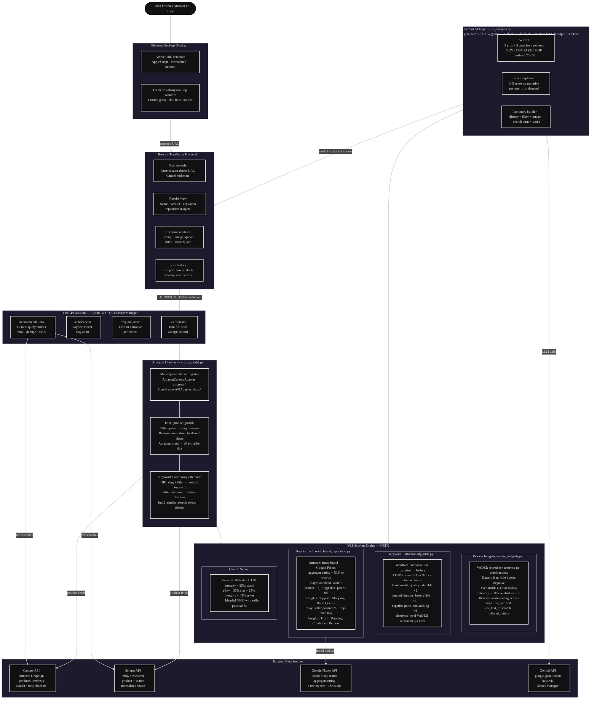

# Nectar

https://github.com/user-attachments/assets/503b7d96-bcd8-418d-aa47-0589f6e007b4


E-commerce lacks trustworthy product intelligence, with consumers losing billions to misleading/inflated reviews and poor purchasing decisions every year. That's why we built Nectar, a product-analyzer Electron desktop app that builds this needed trust layer by comparing products and providing in-depth insights on price, review integrity, quality, brand reputation, and similar alternatives. Nectar recommends the best option to help reduce shopper stress and support more informed purchasing decisions.

## Features
- AI-powered product analysis
- Review integrity detection
- Brand and seller reputation scoring
- Personalized product recommendations
- Product comparison tools
- Scan history and recommendation memory
- Amazon and eBay support

## Technologies Used
- Frontend: React, TypeScript, Vite, CSS
- Desktop Shell: Electron
- Backend: FastAPI, Python
- AI: Google Gemini
- NLP/Scoring: NLTK --> VADER, custom review-integrity logic
- Marketplace Data: Canopy API, ScraperAPI
- Reputation Data: Google Places API
- Storage: Browser localStorage for scan history and recommendation memory
- Deployment: Docker, Google Cloud Run, Cloud Build

---

## Architecture Diagram


# How to Use
## Clone Repository
Requirements:
- Python 3.11+
- Node.js 20+
```powershell
git clone https://github.com/shivankvirdi/Nectar-GDG.git
cd Nectar-GDG
```
## Backend Setup
```powershell
cd backend
python -m venv .venv
```
### Activate virtual environment
```powershell
.venv\Scripts\activate # Windows
source .venv/bin/activate # Mac/Linux
```
### Install dependencies
```powershell
pip install -r requirements.txt
```
## Frontend Setup
Install Node.js (http://nodejs.org/en/download) and add to PATH
```powershell
cd frontend
npm install
```
### Build Frontend Assets
```powershell
npm run build
```
## Running Nectar
### Use Hosted Backend (Requires a secret password): 
The backend is already deployed on Google Cloud!
1. Create file frontend/.env.production
2. Set VITE_API_URL=https://nectar-gdg-93066440894.us-west1.run.app and VITE_NECTAR_SECRET to the password\
   (contact maintainers for access)
3. Run electron:
```
cd frontend
npm run electron:start
```

### Use Local Backend
1. Create .env in ROOT directory and add keys ('Nectar-GDG/.env')\
https://www.canopyapi.co/ (GraphQL API)\
https://aistudio.google.com/app/api-keys  
https://console.cloud.google.com/marketplace/product/google/places.googleapis.com
```
CANOPY_API_KEY=your_api_key_here
GEMINI_API_KEY=your_api_key_here
GOOGLE_PLACES_API_KEY=your_api_key_here
```
2. Set frontend/.env.production to:
```powershell
VITE_API_URL=http://127.0.0.1:8000
```
3. Rebuild frontend:
```powershell
cd frontend
npm run build
```
4. Run backend and electron:
```powershell
#Terminal 1 in frontend directory
npm run electron:start
#Terminal 2 in ROOT
uvicorn backend.main:app --reload
```
## Troubleshooting
### Electron won't start
Delete node_modules and reinstall:
```
npm install
```
### Backend fails to start
Verify:
- CANOPY_API_KEY
- GEMINI_API_KEY
- GOOGLE_PLACES_API_KEY
### CORS or connection issues
#### Verify VITE_API_URL matches your backend URL.
---
Project led by Shivank Virdi and co-developed with Jaycob Pakingan, Iyanna Arches, Aanya Agarwal, & Kaylana Chuan. We hope you enjoy using our application!
